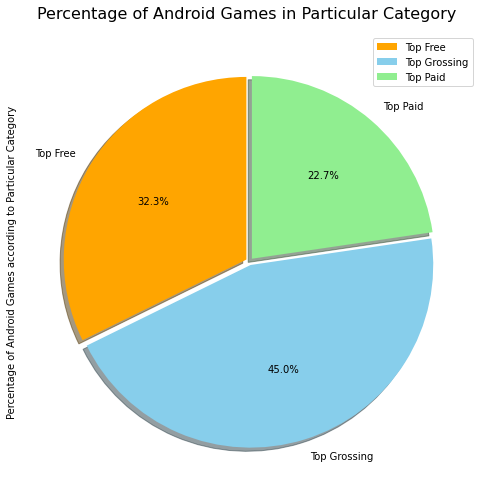
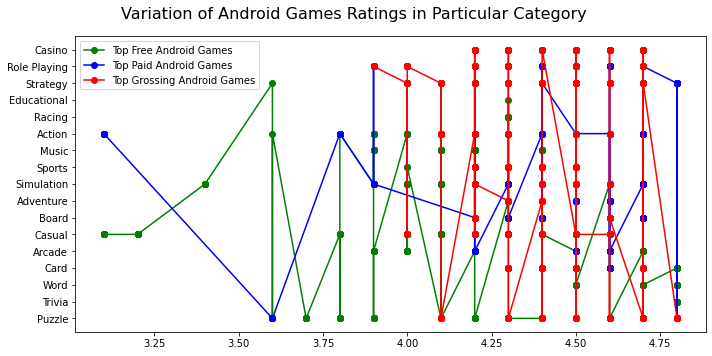
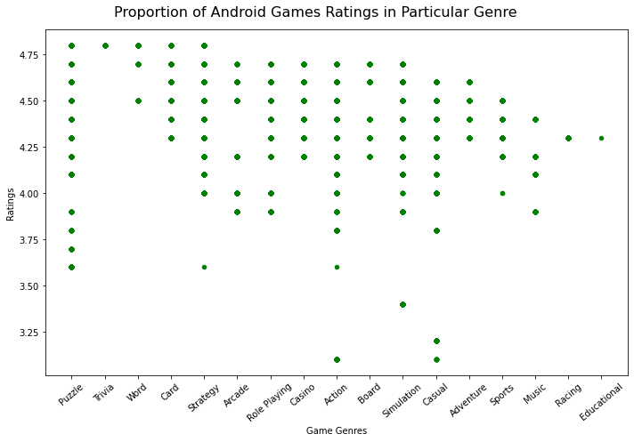
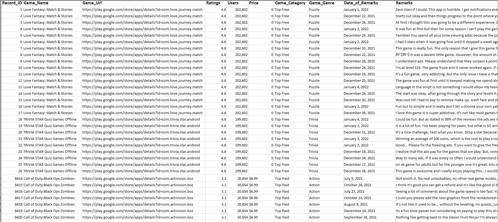

# Dataset-of-Trending-Android-Games-with-UserReviews
#### About Dataset
This is a Dataset of Top Trending Android Games at Google Play Store with User Reviews and other related information like ratings, users and prices etc.
 
## 🔍 Dataset Stats: 
> **4** *Topics* &nbsp;**12** *Total Tables* &nbsp;**1** *Superset* &nbsp;**8423** *Reviews* &nbsp;**245** *Total Top Trending Games* &nbsp;**96** *Top Trending Android Free Games* &nbsp;**97** *Top Trending Android Grossing Games* &nbsp;**52** *Top Trending Android Paid Games* &nbsp;**10** *Columns* &nbsp;

🚧 **Topics Overview**

*1. GameInfo : Top Trending Android Games on Google Play Store* 
*2. Catalagues : Collections of types of Android Games on Google Play Store* 
*3. Lists of Top Trending Android Games according to each Category* 
*4. User Reviews of Top Trending Android Games* 

🚥 **Tables Overview**

*1. GameInfo: Top Free Android Games **~** **2265***rows** **x** **10***columns* 
*2. GameInfo: Top Grossing Android Games **~** **3960***rows** **x** **10***columns* 
*3. GameInfo: Top Paid Android Games **~** **2198***rows** **x** **10***columns* 
  
*4. Catalogue1 : Android Games Genres **~** **17***rows** **x** **2***columns* 
*5. Catalogue2 : Android Games Top Charts **~** **3***rows** **x** **2***columns*  
  
*6. List1 : Top Free Android Games **~** **96***rows** **x** **7***columns*   
*7. List2 : Top Grossing Android Games **~** **97***rows** **x** **7***columns*   
*8. List3 : Top Paid Android Games **~** **52***rows** **x** **7***columns*  
  
*9. Reviews1 : Top Free Android Games **~** **2265***rows** **x** **8***columns*  
*10. Reviews2 : Top Grossing Android Games **~** **3960***rows** **x** **8***columns*  
*11. Reviews3 : Top Paid Android Games **~** **2198***rows** **x** **8***columns*  
  
*12. Superset **~** **8423***rows** **x** **10***columns*  

## Table of Contents
1. [Apps Information](https://github.com/AndroidGamesResearch/Dataset-of-Trending-Android-Games-with-User-Reviews/tree/main/Dataset%20Jan%202022/App%20Info)
2. [Catalogues of Top Trending Android Games](https://github.com/AndroidGamesResearch/Dataset-of-Trending-Android-Games-with-User-Reviews/tree/main/Dataset%20Jan%202022/Catalogues)
3. [Lists of Top Trending Android Games according to Categorization](https://github.com/AndroidGamesResearch/Dataset-of-Trending-Android-Games-with-User-Reviews/tree/main/Dataset%20Jan%202022/Top%20Trending%20Android%20Games%20according%20to%20Categorization) 
4. [Raw Superset of all records in line](https://github.com/AndroidGamesResearch/Dataset-of-Trending-Android-Games-with-User-Reviews/blob/main/Dataset%20Jan%202022/Raw_Superset_of_allRecords.csv) 
5. [User's Reviews](https://github.com/AndroidGamesResearch/Dataset-of-Trending-Android-Games-with-User-Reviews/tree/main/Dataset%20Jan%202022/Reviews)
6. [Download Dataset](https://github.com/AndroidGamesResearch/Dataset-of-Trending-Android-Games-with-User-Reviews/tree/main/Dataset%20Jan%202022/Download)

# Related Publication 
- This is later to be filled 

# Context 
